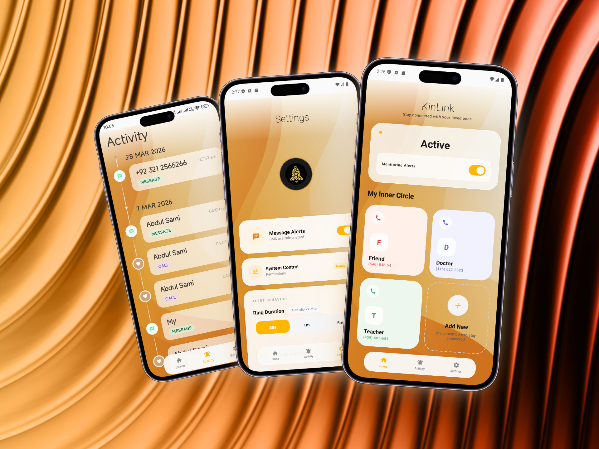
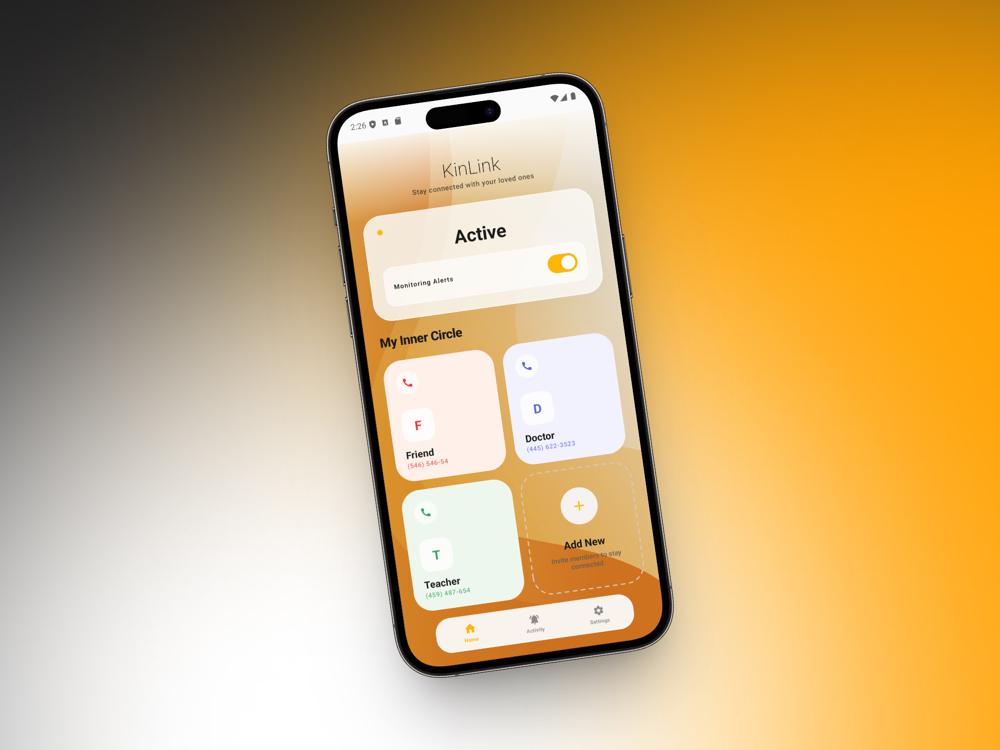
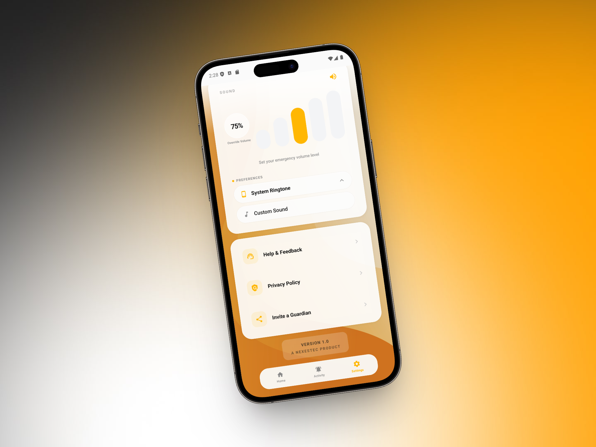
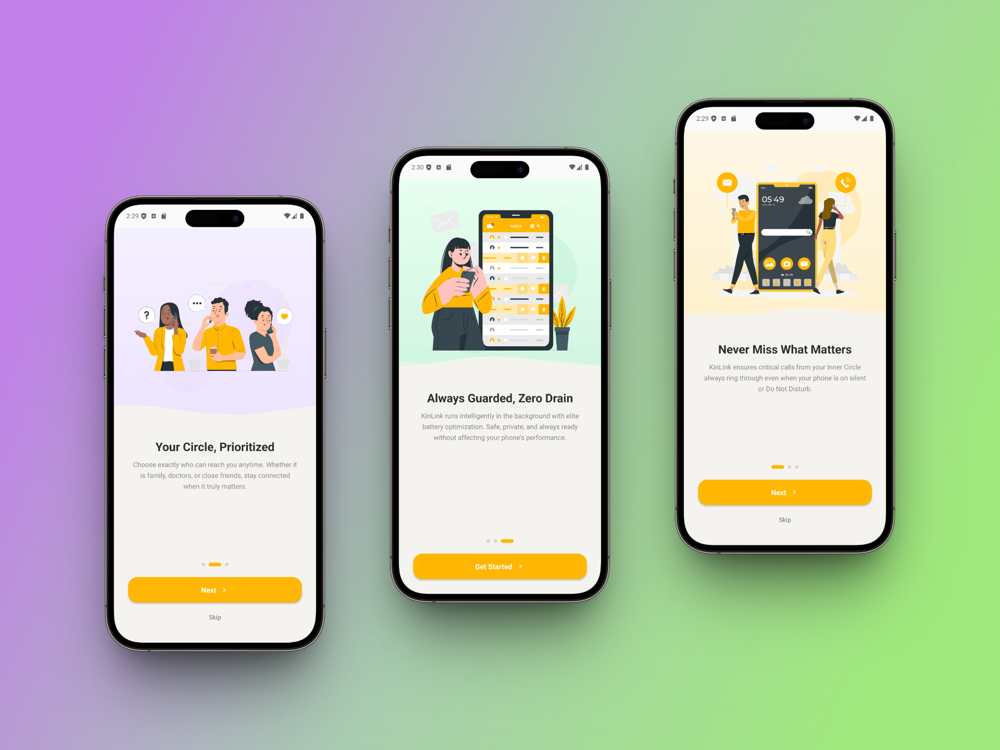
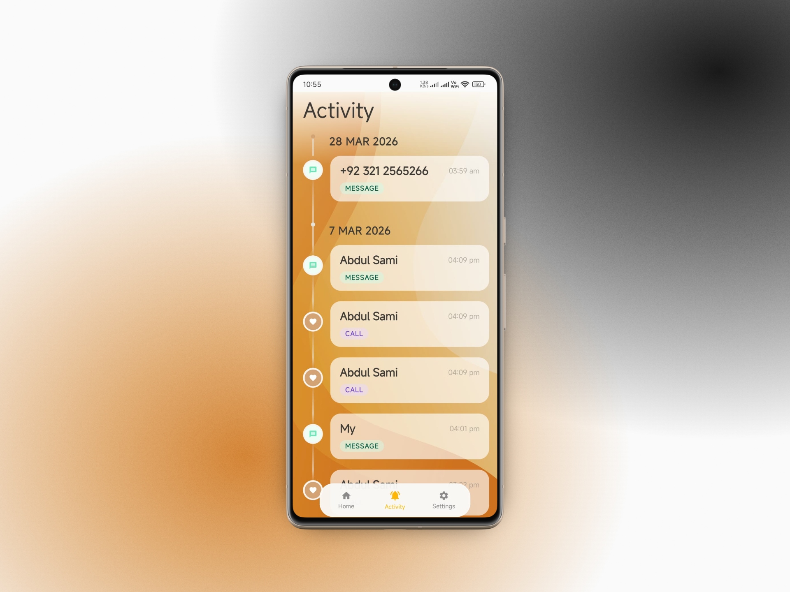
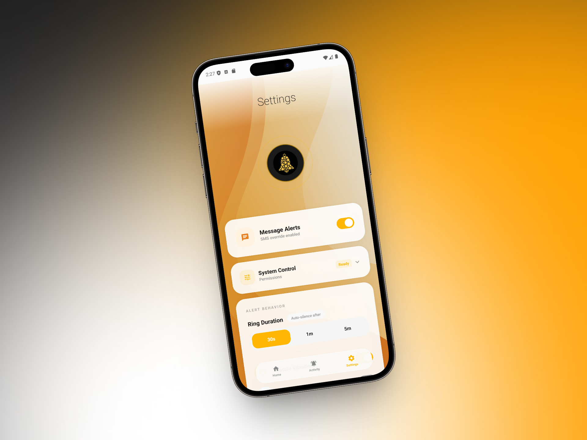
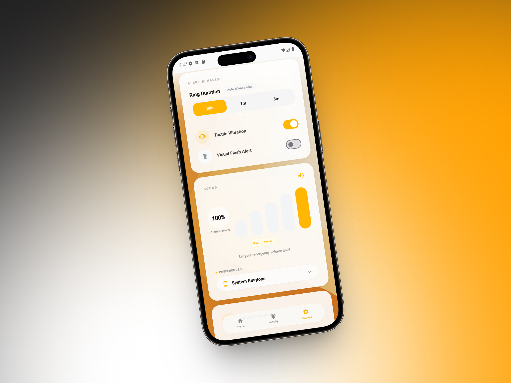
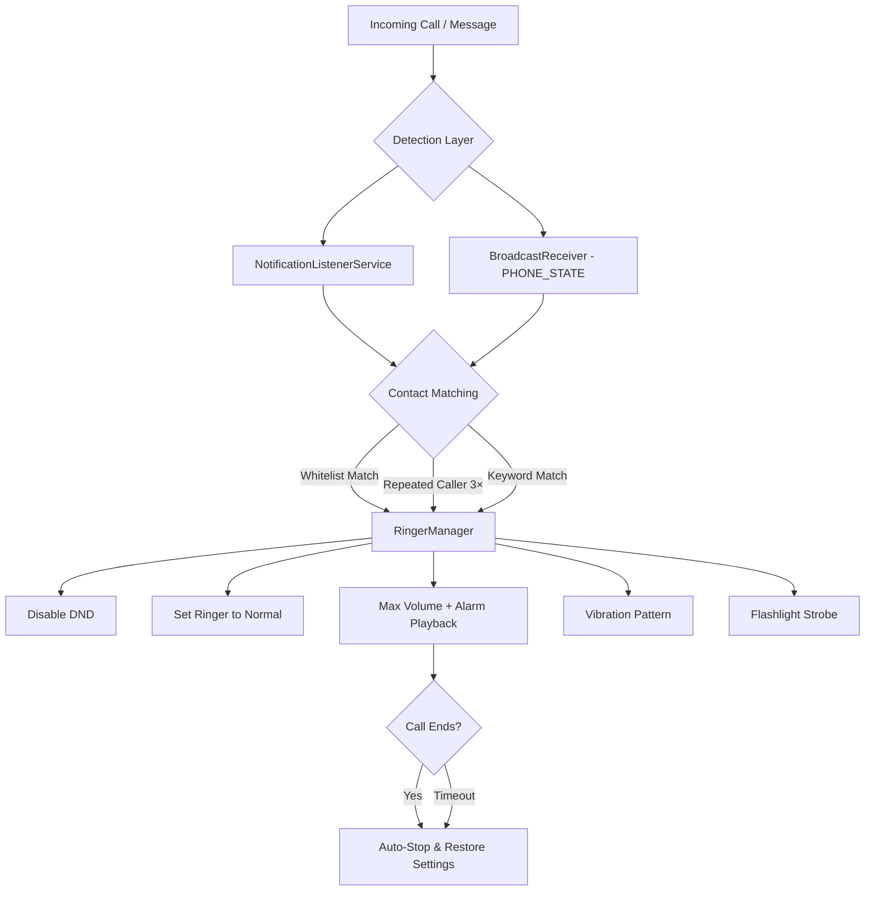

<div align="center">

# 🛡️ Emergency Ringer

### *Never miss a critical call — even in silent mode.*

[](https://developer.android.com)
[](https://kotlinlang.org)
[](https://developer.android.com/jetpack/compose)
[](https://developer.android.com/about/versions/nougat)
[](LICENSE)

Emergency Ringer is your silent guardian — a powerful Android app that **bypasses Do Not Disturb, silent mode, and vibrate-only settings** to ensure emergency calls from your trusted contacts always ring through at maximum volume.

---

</div>

## 📋 Table of Contents

- [The Problem](#-the-problem)
- [The Solution](#-the-solution)
- [Core Features](#-core-features)
- [Screenshots](#-screenshots)
- [Technical Architecture](#-technical-architecture)
- [Project Structure](#-project-structure)
- [Installation](#-installation)
- [Permissions](#-permissions)
- [Contributing](#-contributing)
- [License](#-license)

---

## 🔇 The Problem

You set your phone to **Do Not Disturb** during a meeting, sleep, or study session. But what happens when a family member has an emergency? Their call goes straight to voicemail. You miss it. Critical minutes are lost.

**Every silent phone is a potential missed emergency.**

---

## 💡 The Solution

Emergency Ringer creates a **priority whitelist** — your "Inner Circle" of trusted contacts. When anyone on this list calls or messages you, the app instantly:

1. **Disables Do Not Disturb** temporarily
2. **Overrides silent/vibrate mode** to Normal
3. **Maximizes alarm volume** and plays a loud ringer
4. **Activates haptic vibration** and optional **flashlight strobe**
5. **Auto-stops and restores** all audio settings when the call ends

No more missed emergencies. Ever.

---

## ✨ Core Features

### 🔔 DND & Silent Mode Bypass
Leverages Android's `NotificationManager` policy access to programmatically disable Do Not Disturb and force the ringer to maximum volume — even when the phone is in silent or vibrate-only mode.

### 👥 Priority Contact Whitelist
Add trusted contacts to your "Inner Circle." Only calls and messages from these contacts will trigger the emergency ringer. Everyone else stays silenced as usual.

### 📱 Multi-Platform Call Detection
Detects incoming calls from:
- **Native Phone Dialer** (Samsung, Google, OnePlus, Xiaomi, Huawei, ASUS)
- **WhatsApp** & WhatsApp Business (voice & video calls)
- **Message alerts** from WhatsApp, Telegram, Facebook Messenger, Google Messages, and native SMS

### 🔁 Repeated Caller Detection
If an **unknown number** calls you **3 times within 1 hour**, the app triggers the alarm automatically — because persistence usually means urgency.

### ⏱️ Configurable Auto-Stop
Choose how long the alarm rings before auto-silencing: **30 seconds**, **1 minute**, or **5 minutes**. The app automatically restores your original audio settings afterward.

### 🔦 Flashlight Strobe
Optional strobe light pattern that activates alongside the ringer — useful in loud environments or for hearing-impaired users.

### 📊 Trigger History
A beautiful timeline view of every emergency trigger — who called, when, and why the alarm fired (whitelist match, repeated caller, or keyword detection).

### ⚡ Quick Settings Tile
Toggle protection ON/OFF directly from your notification shade without opening the app.

### 🎵 Custom Ringtones
Choose between the system ringtone or pick a custom alarm sound from your device.

### 🔊 Volume Control
A premium 5-bar volume visualizer lets you set the exact alarm intensity from 40% to MAX LOUD (100%).

---

## 📸 Screenshots

<div align="center">


| | | |
|:-:|:-:|:-:|
|  |  |  |
|  |  |  |
|  | | |

</div>

---

## 🏗️ Technical Architecture

Emergency Ringer is built with a **multi-layered detection and response system** designed for reliability across all Android OEMs.

### System Overview



### Detection Layer — Dual-Path Architecture

The app uses **two independent detection paths** to ensure no call is ever missed:

#### 1. `NotificationListenerService` (Primary)
```
NotificationService.kt — 527 lines
```
- Intercepts **all** incoming notifications system-wide
- Matches the notification sender against the whitelist by **name** and **number**
- Handles WhatsApp/VoIP calls (which don't trigger `TelephonyManager`)
- Detects message notifications from WhatsApp, Telegram, Messenger, and SMS apps
- Implements a **3-second cooldown** to prevent duplicate triggers from notification reposts

#### 2. `CallReceiver` — BroadcastReceiver (Fallback)
```
CallReceiver.kt — 110 lines
```
- Registered for `PHONE_STATE_CHANGED` broadcasts
- Provides **instant phone number matching** for native calls (faster than notification parsing)
- Implements a **4-second fallback timer**: if `NotificationListenerService` doesn't fire within 4s, the receiver triggers the alarm independently
- Auto-stops the ringer on `IDLE` or `OFFHOOK` (call answered/ended)

### Response Engine — `RingerManager`

```
RingerManager.kt — 446 lines
```

The core alarm engine executes the **"Loudness Protocol"**:

| Step | Action | Implementation |
|------|--------|----------------|
| 1 | **Disable DND** | `NotificationManager.setInterruptionFilter(FILTER_ALL)` |
| 2 | **Set Ringer Mode** | `AudioManager.setRingerMode(RINGER_MODE_NORMAL)` |
| 3 | **Max Volume** | Sets `STREAM_ALARM` to configurable percentage (40%–100%) |
| 4 | **Play Alarm** | `MediaPlayer` with `USAGE_ALARM` audio attributes (bypasses silent on most devices) |
| 5 | **Vibration** | `Vibrator` with custom `VibrationEffect` pattern |
| 6 | **Flashlight** | `CameraManager` strobe via coroutine job |
| 7 | **Auto-Stop** | `Handler.postDelayed` with configurable duration (30s / 1m / 5m) |
| 8 | **Restore State** | Saves and restores original ringer mode + DND filter |

### Battery & OEM Optimization Handling

Android OEMs (Xiaomi, Samsung, Huawei, OnePlus) aggressively kill background services. Emergency Ringer combats this with:

- **`REQUEST_IGNORE_BATTERY_OPTIMIZATIONS`** — Requests the OS to exempt the app from Doze mode
- **Foreground Service (`FOREGROUND_SERVICE_SPECIAL_USE`)** — Keeps the `NotificationListenerService` alive on aggressive OEMs like MIUI
- **`WAKE_LOCK`** — Ensures the alarm plays even when the screen is off
- **Guided Setup** — The onboarding flow walks users through disabling battery optimization for their specific device

### Contact Matching — `ContactNormalizer`

```
ContactNormalizer.kt — Smart phone number normalization
```

Phone numbers are matched using **suffix-based comparison** after stripping country codes, spaces, dashes, and formatting. This means `+92 333 984 3774`, `03339843774`, and `333-984-3774` all match the same contact.

### Persistence Layer — `EmergencyContactRepository`

```
EmergencyContact.kt — 313 lines
```

Uses `SharedPreferences` for **synchronous access** (critical because `NotificationListenerService` runs on a system-managed process):

- Whitelist contacts (name + number pipe-delimited)
- Trigger history with timestamps
- All user preferences (volume, auto-stop, vibrate, flash, ringtone source)
- Monitoring enabled/disabled state
- Repeated caller timestamps with 1-hour sliding window

---

## 📁 Project Structure

```
app/src/main/
├── kotlin/com/emergencyringer/app/
│   ├── MainActivity.kt              # Main navigation shell with glassmorphic bottom bar
│   ├── HomeScreen.kt                # Dashboard with status card and contact grid
│   ├── SettingsScreen.kt            # Full settings suite (audio, permissions, ringtone)
│   ├── HistoryScreen.kt             # Timeline view of emergency triggers
│   ├── IntroScreen.kt               # Onboarding flow with guided permissions setup
│   ├── SplashActivity.kt            # Animated splash screen
│   ├── NotificationService.kt       # NotificationListenerService (primary detection)
│   ├── CallReceiver.kt              # BroadcastReceiver (fallback detection)
│   ├── RingerManager.kt             # Core alarm engine (DND bypass, audio, vibration)
│   ├── EmergencyContact.kt          # Data model + SharedPreferences persistence
│   ├── ContactNormalizer.kt         # Phone number normalization utilities
│   ├── ModifierExtensions.kt        # Custom Compose modifiers (magneticAffinity, weightedSpring)
│   ├── IntroIllustrations.kt        # Custom Canvas-drawn onboarding illustrations
│   ├── ProtectionTileService.kt     # Quick Settings tile toggle
│   ├── AppLog.kt                    # Debug logging system
│   └── EmergencyRingerApp.kt        # Application class
├── res/
│   ├── drawable/                     # Icons, backgrounds, vector assets
│   ├── mipmap/                       # Launcher icons
│   └── values/                       # Colors, strings, themes
└── AndroidManifest.xml               # Permissions, services, receivers
```

---

## 🚀 Installation

### Prerequisites

- **Android Studio** Hedgehog (2023.1.1) or later
- **JDK 17**
- **Android SDK 34** (API Level 34)
- Physical Android device (recommended for testing notification listener)

### Build from Source

```bash
# 1. Clone the repository
git clone https://github.com/Asami3315/Emergency-Ringer.git
cd Emergency-Ringer

# 2. Open in Android Studio
#    File → Open → Select the project root

# 3. Build the debug APK
./gradlew :app:assembleDebug

# 4. Install on connected device
adb install app/build/outputs/apk/debug/app-debug.apk
```

### First Launch Setup

The app includes a guided onboarding flow that walks you through:

1. **Notification Access** — Required to intercept incoming call notifications
2. **DND Access** — Required to disable Do Not Disturb when an emergency call arrives
3. **Battery Optimization** — Recommended to prevent the OS from killing the background service
4. **Add Contacts** — Pick your trusted "Inner Circle" from your phone's contacts

---

## 🔐 Permissions

| Permission | Purpose | Required? |
|---|---|---|
| `BIND_NOTIFICATION_LISTENER_SERVICE` | Intercept incoming call/message notifications | ✅ Yes |
| `ACCESS_NOTIFICATION_POLICY` | Disable Do Not Disturb programmatically | ✅ Yes |
| `MODIFY_AUDIO_SETTINGS` | Override ringer mode and volume | ✅ Yes |
| `READ_CONTACTS` | Pick contacts for the whitelist | ✅ Yes |
| `READ_PHONE_STATE` | Detect call state (ringing/answered/ended) | ✅ Yes |
| `VIBRATE` | Haptic feedback during alarm | ✅ Yes |
| `WAKE_LOCK` | Ensure alarm plays with screen off | ⚡ Recommended |
| `FOREGROUND_SERVICE` | Keep service alive on aggressive OEMs | ⚡ Recommended |
| `REQUEST_IGNORE_BATTERY_OPTIMIZATIONS` | Prevent Doze from killing the service | ⚡ Recommended |
| `CAMERA` / `FLASHLIGHT` | Strobe light effect during alarm | ⚙️ Optional |

---

## 🎨 Design Philosophy

Emergency Ringer's UI is built with **Jetpack Compose + Material 3** and follows a premium glassmorphic design language:

- **Glassmorphic Components** — Frosted-glass cards with subtle shadows and crisp 1px white borders
- **Magnetic Snapping** — Custom `Modifier.magneticAffinity()` that makes elements subtly lean toward your finger on touch
- **Weighted Spring (Elasticity)** — Custom `Modifier.weightedSpring()` that creates a "push into foam" effect with elastic bounce-back
- **Spring-Based Animations** — All interactions use physics-based `Animatable` with `Spring` specs for organic, buttery-smooth movement
- **Hardware-Accelerated** — All touch interactions use `graphicsLayer` transformations for zero frame drops

---

## 🤝 Contributing

Contributions are welcome! If you'd like to improve Emergency Ringer:

1. **Fork** the repository
2. **Create** a feature branch (`git checkout -b feature/amazing-feature`)
3. **Commit** your changes (`git commit -m 'Add amazing feature'`)
4. **Push** to the branch (`git push origin feature/amazing-feature`)
5. **Open** a Pull Request

---

## 📄 License

This project is licensed under the **MIT License** — see the [LICENSE](LICENSE) file for details.

---

<div align="center">

**Built with ❤️ by [Abdul Sami](https://github.com/Asami3315)**

*Because no call should go unheard when it matters most.*

</div>
